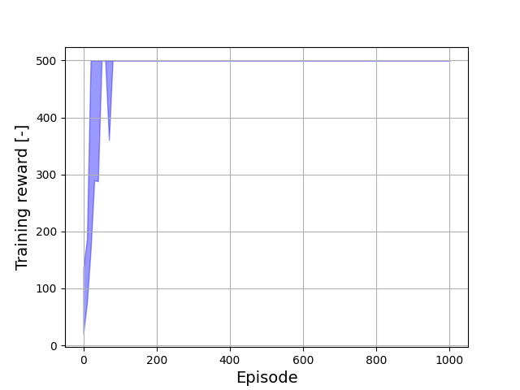

# JAXAgents

<p align="center">
  
  
  
</p>

JAXAgents is a high-performance (Multi-Agent) Reinforcement Learning library built on [JAX](https://github.com/google/jax), designed for rapid experimentation, scalable training of RL agents and fast hyperparameter tuning. It supports a variety of algorithms and environments, making it suitable for both research and practical applications.

## 🛠️ Features

- **RL**: Implementations of popular RL algorithms, including:
  - **Q-learning**:
    - Deep Q Networks (DQN)
    - Double Deep Q Networks (DDQN)
    - Categorical DQN (C51)
    - Quantile Regression DQN (QRDQN)
  - **Policy Gradient**:
    - REINFORCE
    - Proximal Policy Optimization (PPO) with Generalized Advantage Estimation (GAE)
  - **Multi-Agent RL**:
    - Independent PPO (IPPO)

- **High Performance**: Leveraging JAX's capabilities for just-in-time compilation and automatic differentiation, enabling efficient computation on CPUs and GPUs.

- **Modular Design**: Structured for easy extension and customization, facilitating experimentation with new algorithms and environments.

## 📦 Installation

JAXagents is also available on [PyPI](https://pypi.org/project/jaxagents/)
Ensure you have Python 3.10 or higher installed. Then, install JAX Agents via pip:

```bash
pip install jaxagents
```

## 🏁 Getting Started

Here's a simple example to train a PPO agent:

```python
import jaxagents

# Initialize environment and agent
env = jaxagents.environments.make('CartPole-v1')
agent = jaxagents.agents.PPO(env)

# Train the agent
agent.train(num_episodes=1000)
```

For more detailed examples and usage, refer to the [documentation](https://jax-agents.readthedocs.io/en/latest/).

## 🚀 Performance

JAXAgents enables extremely fast optimization. Below is an example of a PPO agent trained on CartPole-v1 — achieving near-optimal performance within approximately 100 episodes:

<p align="center">
  
</p>

<p align="center">
  <em>Minimum and maximum returns per training episode.<br>JAXAgents enables lightning-fast learning: PPO solves CartPole-v1 in approximately 100 episodes.</em>
</p>

## 📖 Documentation

Comprehensive documentation is available at [jax-agents.readthedocs.io](https://amavrits.github.io/jax-agents/), covering:

- Installation and setup
- Detailed API references
- Tutorials and examples
- Advanced topics and customization

## 📄 License

This project is licensed under a proprietary license. For more information, please refer to the [LICENSE](https://github.com/amavrits/jax-agents/blob/main/LICENSE) file.

---

For any questions or contributions, feel free to open an issue or submit a pull request on the [GitHub repository](https://github.com/amavrits/jax-agents).
